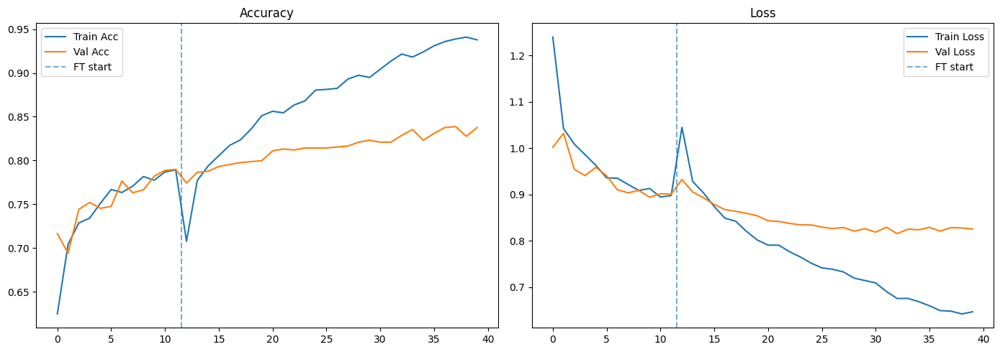
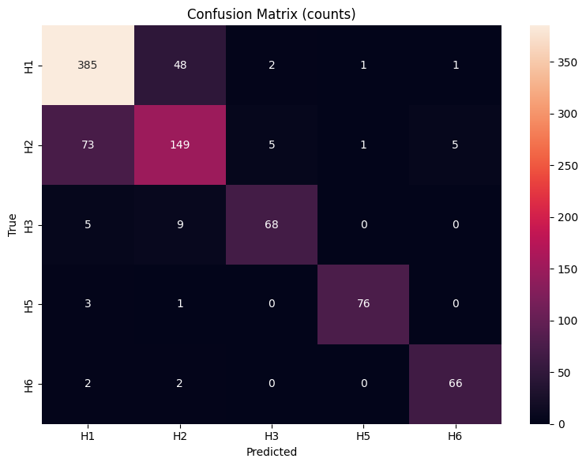
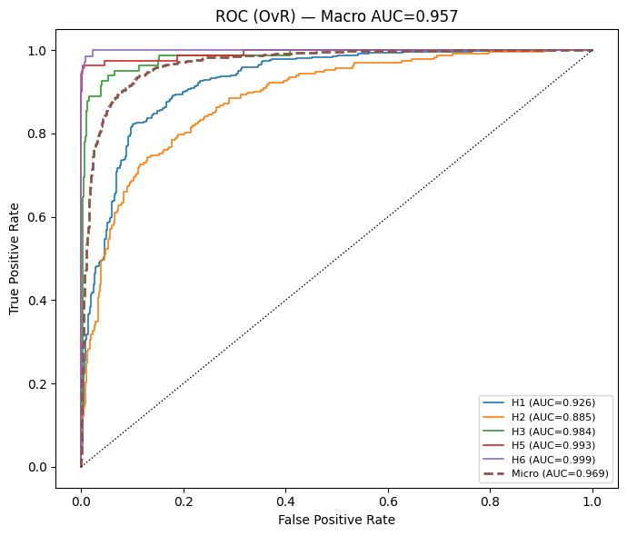

<h1 align="center">🧫 Fungal Image Classification using <span style="color:#2196F3">ResNet50</span> (Transfer Learning)</h1>

<p align="center">
  <b>Deep Learning project for fungal species identification using Residual Networks (ResNet50)</b><br>
  <i>Built with TensorFlow · Keras · Python · Jupyter</i>
</p>

<p align="center">
  
  
  
  
</p>

---

## 🌟 Overview

This project implements a **ResNet50-based transfer learning pipeline** to classify microscopic fungal images.  
By leveraging **residual connections** and **ImageNet pretraining**, the network achieves strong generalization while avoiding vanishing gradients.  

We adopt a **two-phase schedule**:  
- Train the classification head with the backbone frozen  
- Fine-tune the top residual block (`conv5_*`) at a small learning rate for improved adaptation.

---

## 🧠 Model Architecture

| Component | Description |
|------------|-------------|
| **Backbone** | Pre-trained `ResNet50` (`include_top=False`) |
| **Head** | GAP → Dropout → Dense(512, ReLU, L2) → Dropout → Dense(C, Softmax, L2) |
| **Regularization** | Dropout, L2 weight decay, Label Smoothing (0.1) |
| **Optimizer** | Adam |
| **Learning Rates** | 1e-3 (head), 1e-5 (fine-tuning) |
| **Training Phases** | Phase A: frozen backbone → Phase B: fine-tune conv5_* |
| **Epochs** | 40 (12 + 28) |

🧩 *Residual links improve gradient flow, making the model deeper and more stable during fine-tuning.*:contentReference[oaicite:0]{index=0}

---

## 🧬 Dataset

📦 **Source:** [Microscopic Fungi Image — DeFungi Dataset (Kaggle)](https://www.kaggle.com/)  
🧪 **Classes (5):**
1. *Candida albicans*  
2. *Aspergillus niger*  
3. *Trichophyton rubrum*  
4. *Trichophyton mentagrophytes*  
5. *Epidermophyton floccosum*

🧹 **Preprocessing:**
- Resize → `224×224`
- Normalize → `[0, 1]`
- Apply augmentations (rotation, flipping, zoom)

---

## ⚙️ Training Configuration

| Parameter | Value |
|------------|--------|
| **Epochs** | 40 |
| **Batch Size** | 32 |
| **Optimizer** | Adam |
| **Learning Rate** | 1e-3 → 1e-5 |
| **Loss Function** | Categorical Cross-Entropy (Label Smoothing 0.1) |
| **Framework** | TensorFlow / Keras |

---

## 📈 Results

| Metric | Score |
|--------|--------|
| ✅ **Accuracy** | **82.48%** |
| 🎯 **Macro F1** | **85.66%** |
| 💹 **ROC AUC** | **0.969** |

🔥 **Key Insight:** The residual architecture enables deeper fine-tuning without overfitting, yielding a large boost over VGG19’s 70% baseline.

---

## 🔍 Visual Insights

<p align="center">
  
  
  
  
</p>

✨ **Confusion Matrix** → shows per-class predictions  
📉 **ROC Curves** → demonstrate high separability across all fungal classes  

---

## 🚀 Usage

```bash
# Clone the repository
git clone https://github.com/<your-username>/<repo-name>.git
cd <repo-name>

# Install dependencies
pip install -r requirements.txt

# Run the notebook
jupyter notebook ResNet50.ipynb
